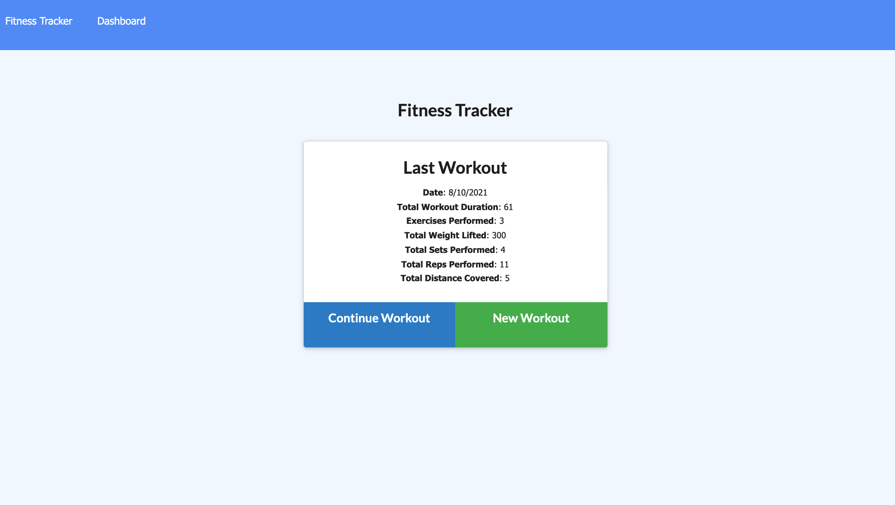

# 18 - NoSQL: Workout Tracker

## Project

The project consists on creating a Workout Tracker. The scope covers the architecture of the entire back-end: a Mongo database with a Mongoose schema, and routes handled with Express.

- [UserStory](#UserStory)
- [AcceptanceCriteria](#AcceptanceCriteria)
- [Screenshots](#Screenshots&Test)
- [Demo](#Demo)

## User Story

* As a user, I want to be able to view create and track daily workouts. I want to be able to log multiple exercises in a workout on a given day. I should also be able to track the name, type, weight, sets, reps, and duration of exercise. If the exercise is a cardio exercise, I should be able to track my distance traveled.

## Acceptance Criteria

When the user loads the page, they should be given the option to create a new workout or continue with their last workout.

The user should be able to:

  * Add exercises to the most recent workout plan.

  * Add new exercises to a new workout plan.

  * View the combined weight of multiple exercises from the past seven workouts on the `stats` page.

  * View the total duration of each workout from the past seven workouts on the `stats` page.

## Screenshots 

The following images show the application appearance:

## Demo URL 

You can find the app deployed on the following link  
<a href="https://pacific-escarpment-19734.herokuapp.com/" target="_blank">Heroku deployed app</a>

## Used Frameworks/Technologies

- Node.js
- MongoDB
- Mongoose
- JavaScript

### Contributor

Nicolas Cedano Avena
- - -
© 2021 Trilogy Education Services, LLC, a 2U, Inc. brand. Confidential and Proprietary. All Rights Reserved